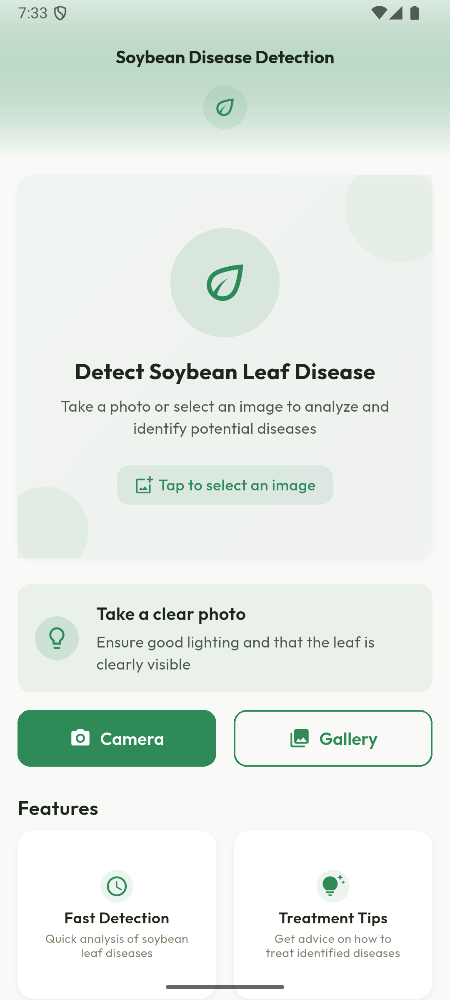
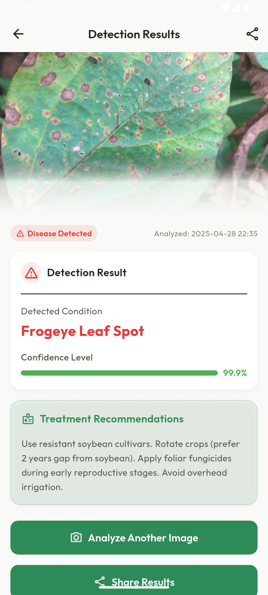
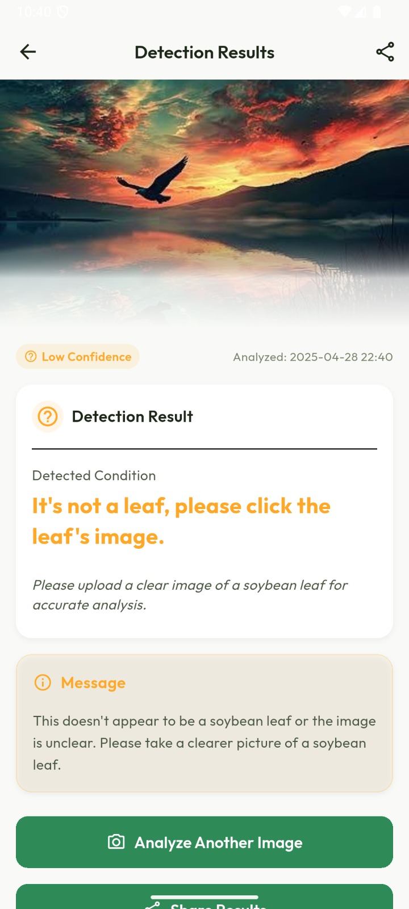
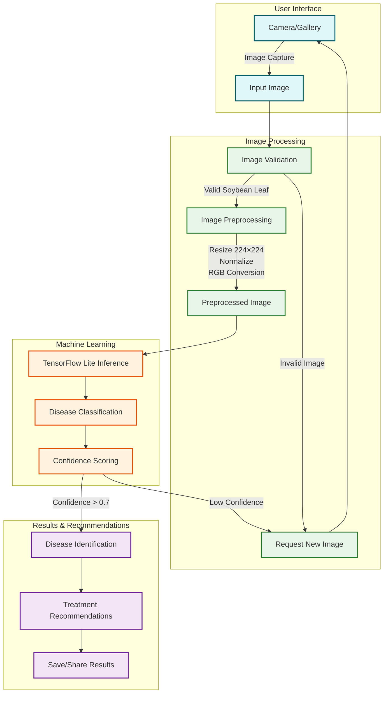

# Soybean Disease Detection

<div align="center">
  
  <h3 align="center">AI-Powered Soybean Leaf Disease Detection</h3>
  <p align="center">
    A mobile application for quick and accurate identification of soybean leaf diseases using machine learning
  </p>
  
  <!-- Badges -->
  <p align="center">
    
    
    
    
  </p>
</div>

## 📋 Table of Contents
- [Overview](#-overview)
- [Key Features](#-key-features)
- [Screenshots](#-screenshots)
- [System Workflow](#-system-workflow)
- [Technologies Used](#-technologies-used)
- [Machine Learning Model](#-machine-learning-model)
- [Application Architecture](#-application-architecture)
- [Disease Information](#-disease-information)
- [Installation](#-installation)
- [Usage](#-usage)
- [Project Structure](#-project-structure)
- [Performance](#-performance)

- [Contributors](#-contributors)
- [License](#-license)

## 🌟 Overview

The Soybean Disease Detection application is a sophisticated mobile solution designed to help farmers and agricultural professionals identify diseases affecting soybean plants. Using a cutting-edge machine learning model deployed within a Flutter application, users can quickly capture or upload photos of soybean leaves and receive immediate disease identification along with treatment recommendations.

This tool addresses a critical need in agricultural management by providing early disease detection without requiring an internet connection, enabling timely intervention to prevent crop damage and yield loss.

## 🔑 Key Features

- **Disease Identification**: Identify 7 different soybean leaf conditions: Bacterial Pustule, Frogeye Leaf Spot, Healthy, Rust, Sudden Death Syndrome, Target Leaf Spot, and Yellow Mosaic
- **Fast Detection**: Instant analysis of leaf images right on the device
- **Works Offline**: Complete functionality without internet connectivity
- **Treatment Guidance**: Provides detailed precautionary measures for each identified disease
- **User-Friendly Interface**: Clean, intuitive design accessible to users of all technical skill levels
- **Image Capture**: Take photos directly or select images from the device gallery
- **Confidence Metrics**: Visualization of detection confidence level for transparency
- **Image Validation**: Verifies whether the uploaded image contains a soybean leaf

## 📱 Screenshots

<div align="center">
  <table>
    <tr>
      <td></td>
      <td></td>
      <td></td>
    </tr>
    <tr>
      <td align="center"><b>Home Screen</b></td>
      <td align="center"><b>Analysis Process</b></td>
      <td align="center"><b>Disease Results</b></td>
    </tr>
  </table>
</div>

## 🔄 System Workflow

<div align="center">



</div>

The workflow diagram above illustrates the end-to-end process of the application:

1. **Image Acquisition**: User captures a photo or selects from gallery
2. **Preprocessing**: Image is resized, normalized, and prepared for analysis 
3. **ML Inference**: TensorFlow Lite model processes the image
4. **Disease Classification**: System identifies the disease category
5. **Confidence Calculation**: Prediction confidence is assessed
6. **Result Presentation**: User is shown the disease diagnosis with recommendations
7. **Treatment Guidance**: Precautionary measures are provided based on diagnosis

## 💻 Technologies Used

### Mobile Development
- **Framework**: Flutter 3.29.3
- **Language**: Dart
- **Architecture Pattern**: Provider for state management

### Machine Learning
- **Model**: TensorFlow Lite optimized for mobile deployment
- **Base Architecture**: Modified VGG16 for image classification
- **Pre-processing**: ImageNet mean normalization (BGR: 103.939, 116.779, 123.68)
- **Image Size**: 224×224 pixels
- **Output**: 7 class classification with confidence scores

### Dependencies
- `provider`: ^6.0.5 - State management
- `image_picker`: ^1.0.4 - Camera and gallery integration
- `flutter_spinkit`: ^5.2.0 - Loading animations
- `tflite_flutter`: ^0.11.0 - TensorFlow Lite integration
- `permission_handler`: ^12.0.0+1 - Device permission management
- `logger`: ^2.5.0 - Application logging
- `image`: ^4.5.4 - Image processing
- `path_provider`: ^2.1.5 - File system access
- `flutter_svg`: ^2.1.0 - SVG rendering
- `share_plus`: ^11.0.0 - Sharing functionality

## 🧠 Machine Learning Model

The application employs a TensorFlow Lite model trained to recognize soybean leaf diseases with high accuracy. The model:

- Is trained on a diverse dataset of soybean leaf images
- Uses a confidence threshold of 0.7 to ensure reliable predictions
- Processes images through several preprocessing steps to normalize input
- Reports both the disease classification and prediction confidence
- Validates that the input image contains a soybean leaf

### Model Architecture
```
Input (224×224×3)
    ↓
Conv Layers + MaxPooling
    ↓
Flatten
    ↓
Dense Layer (512 neurons)
    ↓
Dropout (0.5)
    ↓
Output Layer (7 classes) with Softmax
```

## 🏗️ Application Architecture

### Core Components

1. **Services**:
   - `MLService`: Handles model loading, image preprocessing, and disease inference
   - `DiseaseService`: Manages disease information and treatment recommendations
   - `PermissionService`: Manages camera and storage permissions

2. **Providers**:
   - `DetectionProvider`: Manages application state, image selection, and prediction workflows

3. **Models**:
   - `PredictionResult`: Encapsulates prediction outputs including disease class and confidence
   - `DiseaseInfo`: Contains disease details and treatment recommendations

4. **Screens**:
   - `HomeScreen`: Main interface with image selection and analysis options
   - `ResultScreen`: Displays detection results and treatment recommendations

5. **Components**:
   - Design system with consistent color schemes, spacing, and typography
   - Reusable UI components for consistent visual language

### Architecture Diagram

```
┌─────────────────────┐     ┌─────────────────────┐
│      UI Layer       │     │     Data Layer      │
│  ┌───────────────┐  │     │  ┌───────────────┐  │
│  │   Screens     │  │     │  │    Models     │  │
│  └───────────────┘  │     │  └───────────────┘  │
│  ┌───────────────┐  │     │  ┌───────────────┐  │
│  │  Components   │◄─┼─────┼─►│   Services    │  │
│  └───────────────┘  │     │  └───────────────┘  │
└─────────────────────┘     └─────────────────────┘
          ▲                           ▲
          │                           │
          ▼                           ▼
┌─────────────────────────────────────────────────┐
│                 Provider Layer                  │
│             (State Management)                  │
└─────────────────────────────────────────────────┘
          ▲                           ▲
          │                           │
          ▼                           ▼
┌─────────────────────┐     ┌─────────────────────┐
│  Device Resources   │     │    ML Resources     │
│  ┌───────────────┐  │     │  ┌───────────────┐  │
│  │    Camera     │  │     │  │  TFLite Model │  │
│  └───────────────┘  │     │  └───────────────┘  │
│  ┌───────────────┐  │     │  ┌───────────────┐  │
│  │    Storage    │  │     │  │  Label Data   │  │
│  └───────────────┘  │     │  └───────────────┘  │
└─────────────────────┘     └─────────────────────┘
```

## 🦠 Disease Information

The application provides detection and information for the following soybean leaf conditions:

<table>
  <thead>
    <tr>
      <th>Disease</th>
      <th>Characteristics</th>
      <th>Precautions</th>
    </tr>
  </thead>
  <tbody>
    <tr>
      <td><strong>Bacterial Pustule</strong></td>
      <td>Small raised spots or pustules</td>
      <td>Use certified disease-free seeds, practice crop rotation, use resistant varieties</td>
    </tr>
    <tr>
      <td><strong>Frogeye Leaf Spot</strong></td>
      <td>Circular lesions with gray centers</td>
      <td>Use resistant cultivars, rotate crops, apply foliar fungicides</td>
    </tr>
    <tr>
      <td><strong>Rust</strong></td>
      <td>Reddish-brown pustules</td>
      <td>Use rust-resistant varieties, apply fungicides, remove infected debris</td>
    </tr>
    <tr>
      <td><strong>Sudden Death Syndrome</strong></td>
      <td>Interveinal chlorosis and necrosis</td>
      <td>Plant resistant varieties, improve drainage, manage soil nematodes</td>
    </tr>
    <tr>
      <td><strong>Target Leaf Spot</strong></td>
      <td>Circular lesions with concentric rings</td>
      <td>Rotate with non-host crops, improve air circulation, apply fungicides</td>
    </tr>
    <tr>
      <td><strong>Yellow Mosaic</strong></td>
      <td>Yellow mottling pattern</td>
      <td>Use virus-resistant varieties, control aphid populations, remove infected plants</td>
    </tr>
    <tr>
      <td><strong>Healthy</strong></td>
      <td>Normal leaf appearance</td>
      <td>Regular monitoring, proper fertilization, early pest control</td>
    </tr>
  </tbody>
</table>

## 📥 Installation

```bash
# Clone the repository
git clone https://github.com/akashmaurya99/soybean_detection.git

# Navigate to project directory
cd soybean_detection

# Install dependencies
flutter pub get

# Run the application
flutter run
```

### Requirements
- Flutter SDK 3.29.0 or higher
- Dart SDK 3.2.0 or higher
- Android Studio / XCode
- Android SDK (for Android deployment)
- iOS Development Tools (for iOS deployment)

## 🚀 Usage

1. Launch the application
2. Select "Take Photo" or "Choose from Gallery" to select a soybean leaf image
3. Press "Analyze Disease" to process the image
4. View the results showing disease identification and confidence level
5. Read the recommended treatment measures
6. Share results or take another picture as needed

## 📂 Project Structure

```
lib/
├── components/       # Reusable UI components
├── design_system/    # Theme, colors, typography
├── models/           # Data models
│   ├── disease_info_model.dart
│   ├── prediction_model.dart
│   ├── soybean_model.tflite  # ML model file
│   └── labels.txt            # Disease class labels
├── providers/        # State management
├── screens/          # Application screens
├── services/         # Business logic
│   ├── disease_service.dart  # Disease information management
│   ├── ml_service.dart       # Machine learning inference
│   └── permission_service.dart  # Device permissions
├── utils/            # Helper functions
└── main.dart         # Application entry point
```

## 🔍 Performance

<table>
  <tr>
    <th>Metric</th>
    <th>Performance</th>
    <th>Notes</th>
  </tr>
  <tr>
    <td>Inference Time</td>
    <td>< 1 second</td>
    <td>On most modern devices</td>
  </tr>
  <tr>
    <td>Model Size</td>
    <td>~59MB</td>
    <td>Optimized for mobile deployment</td>
  </tr>
  <tr>
    <td>Accuracy</td>
    <td>~90%</td>
    <td>On validated test datasets</td>
  </tr>
  <tr>
    <td>Memory Usage</td>
    <td>Efficient</td>
    <td>Optimized for resource-constrained devices</td>
  </tr>
</table>


## 👨‍💻 Contributors

- **Akash Maurya** - Lead Developer ([@akashmaurya99](https://github.com/akashmaurya99))

## 📄 License

This project is licensed under the [MIT License](LICENSE) - see the LICENSE file for details.

---

<div align="center">
  Made with ❤️ for sustainable agriculture
</div>
